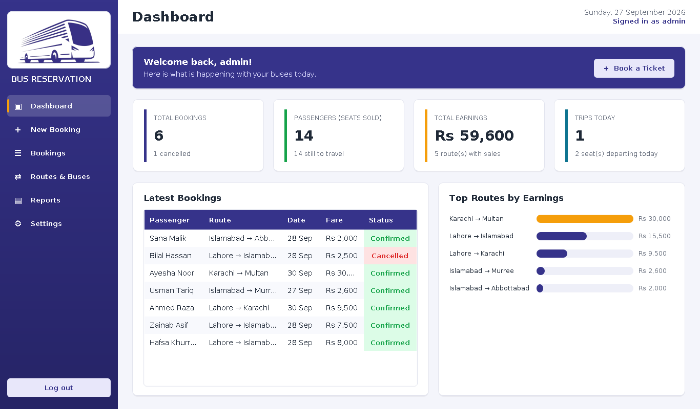
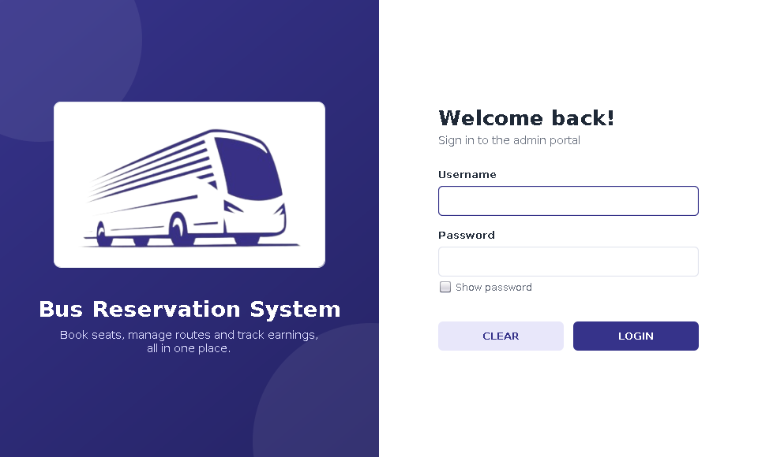
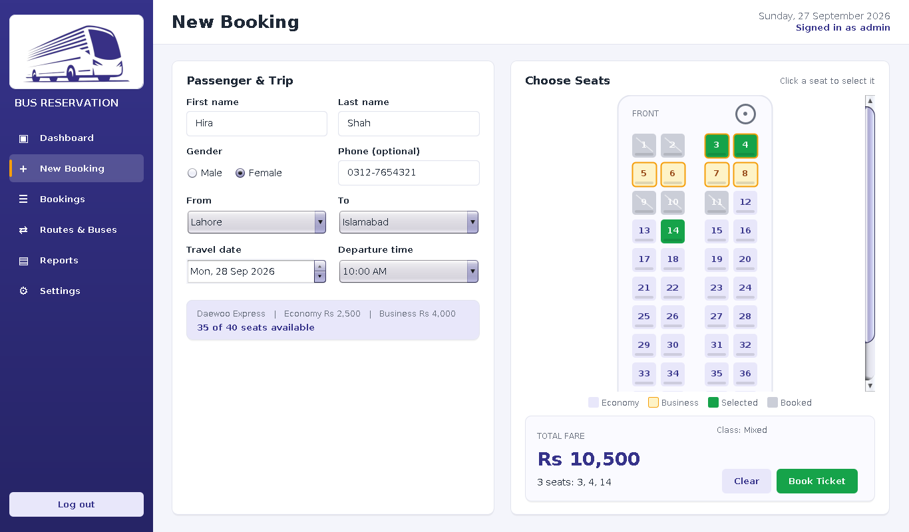
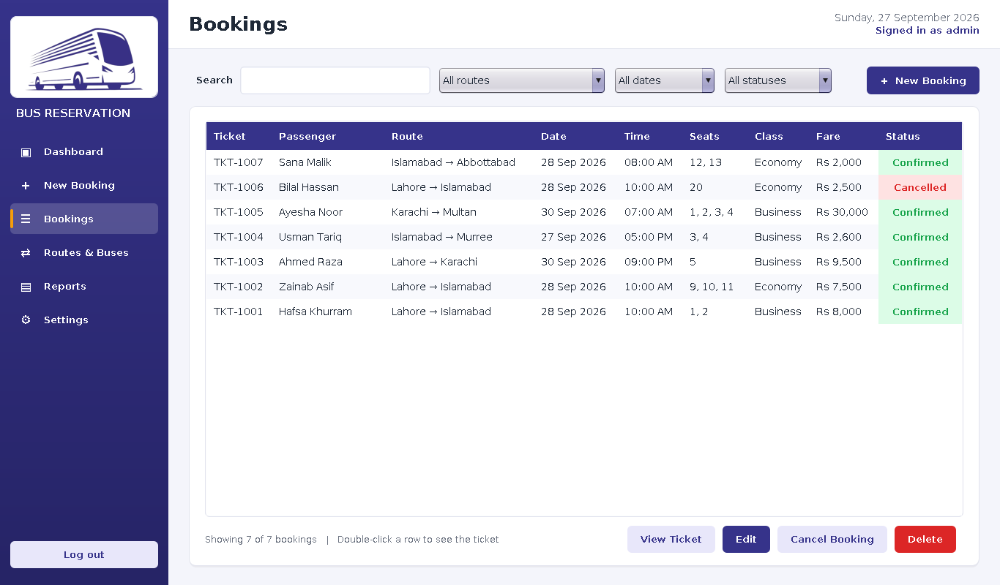
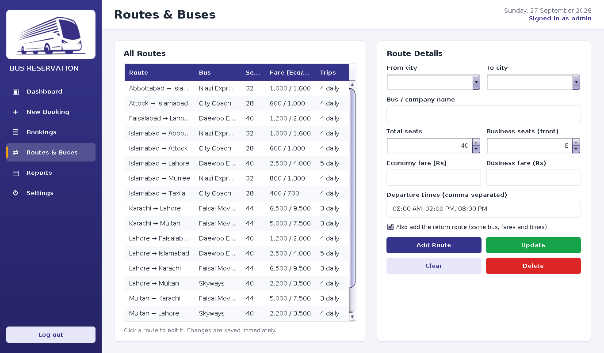
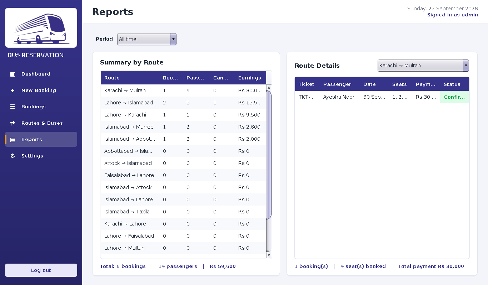
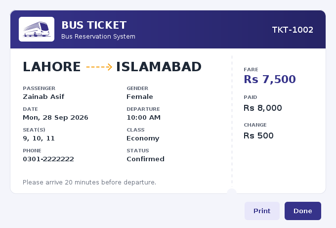

# 🚌 Bus Reservation System

A desktop **bus ticket booking system** built in **Java Swing** as our **Object Oriented Programming semester project** at COMSATS University.

The admin can manage routes and buses, book tickets by choosing seats on a live seat map, collect payment, print tickets and view earnings reports. **No data is hard-coded**: cities, buses, seat counts, fares and departure times are all managed from inside the app and saved automatically.



## ✨ Features

| Feature | Description |
|---|---|
| 🔐 **Secure login** | Admin login with 3 attempts. The password is stored as a SHA-256 hash and can be changed in Settings |
| 📊 **Dashboard** | Live totals for bookings, passengers, earnings and today's trips, the latest bookings, and a top-routes chart |
| 💺 **Seat map booking** | Click seats on a 2+2 bus layout. Booked seats are locked, and Business seats are highlighted |
| 🧾 **Payment & tickets** | Cash payment with automatic change, a boarding-pass style ticket, and printing |
| 🔎 **Bookings manager** | Search by name, ticket or phone. Filter by route, date and status. View, edit, cancel or delete bookings |
| 🛣️ **Routes & buses** | Add, edit and delete routes: cities, bus name, total and Business seats, fares and departure times |
| 📈 **Reports** | Passengers and earnings per route (all time, this month, today or upcoming), plus a passenger list for each route |
| 💾 **Auto-save** | Everything is saved to the `data/` folder instantly and loaded again on start |

### Validation built in
- Names must be letters, the phone number format is checked, and gender is required
- Each seat can only be booked once per trip. The same seat on a different date or time is free
- Past dates and buses that have already left are blocked
- Payment must cover the full fare
- A route with upcoming bookings cannot be deleted, and a bus cannot shrink below a booked seat number

## 📸 Screenshots

| Login | New Booking |
|---|---|
|  |  |

| Bookings | Routes & Buses |
|---|---|
|  |  |

| Reports | Ticket |
|---|---|
|  |  |

## ▶️ How to Run

**Requirements:** JDK 17 or newer.

**Default login:** username `admin`, password `admin`. You can change these in **Settings**.

### NetBeans
1. **File → Open Project** and select the `BusReservationSystem` folder.
2. Press **F6** (Run Project).

### VS Code
1. Install the **Extension Pack for Java**.
2. **File → Open Folder** and select the `BusReservationSystem` folder.
3. Open `src/busreservationsystem/BusReservationSystem.java` and click **Run**, or press **F5**.

### Command line
```bash
javac -d bin src/busreservationsystem/*.java
cp src/busreservationsystem/*.png bin/busreservationsystem/     # Windows: copy src\busreservationsystem\*.png bin\busreservationsystem\
java -cp bin busreservationsystem.BusReservationSystem
```

The first time the app runs, it creates a `data/` folder with sample routes between Lahore, Islamabad, Karachi, Multan, Faisalabad, Murree, Abbottabad, Taxila and Attock. You can edit or delete them in **Routes & Buses**.

## 🧱 Project Structure

```
src/busreservationsystem/
├── BusReservationSystem.java   Entry point
├── LoginFrame.java             Admin login screen
├── AdminPortal.java            Main window with sidebar navigation
├── DashboardPanel.java         Totals, latest bookings and chart
├── BookingPanel.java           New / edit booking with seat selection
├── SeatMapPanel.java           Clickable bus seat map
├── BookingsPanel.java          Search, filter, edit, cancel and delete bookings
├── RoutesPanel.java            Manage routes, buses, fares and timings
├── ReportsPanel.java           Earnings and passenger reports
├── SettingsPanel.java          Change login details
├── TicketDialog.java           Printable ticket
├── BarChart.java               Simple bar chart component
├── Theme.java                  Colours, fonts and styled components
├── DataStore.java              Loads and saves all data (CSV files)
├── Route.java                  Route / bus model
└── Booking.java                Passenger booking model
```

### OOP concepts used
- **Encapsulation:** `Booking` and `Route` keep their fields private, with getters
- **Inheritance:** every screen extends `JPanel` or `JFrame`, and custom widgets extend Swing components
- **Polymorphism:** overridden `paintComponent` methods draw the seat map, ticket, cards and chart
- **Abstraction:** `DataStore` hides how data is stored, so screens only call methods like `addBooking()`
- **Event handling:** listeners keep every screen updated when data changes

## 👩‍💻 Authors

- **Hafsa Khurram** (FA22-BCS-058)
- **Zainab Asif** (FA22-BCS-068)

Submitted to **Dr. Abdul Nasir Khan**, COMSATS University Islamabad.
